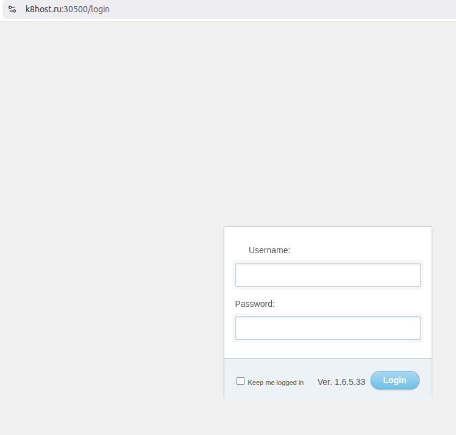

Этот репозиторий содержит пример полного цикла развертывания Node.js приложения в кластере Kubernetes в облаке Selectel.

Инфраструктура создаётся автоматически с использованием:
- **Terraform** — создание серверов
- **Ansible** — настройка Kubernetes
- **Kubernetes manifests** — запуск приложения

Приложение публикуется через домен https://k8host.ru:30500 с использованием TLS-сертификата Let's Encrypt.

---

### Что нужно для запуска?

1. Готовое и уже докеризированное приложение. Загружено в Docker Hub
2. Учетная запись в Selectel, немного денег для запуска виртуальных серверов
3. Нужен домен, в этом примере k8host.ru куплен и делегирован в админке Selectel
4. Понимание как пользоваться командами ansible-playbook, terraform, kubectl, ssh

---

### Процесс развертывания

Развертывание состоит из трёх этапов.

### 1. Создание инфраструктуры (Terraform)
В директории `terraform` находится инструкция `readme-terraform.txt`

На этом этапе создаются:
- master node
- worker node
- приватная сеть

### 2. Настройка Kubernetes (Ansible)
В директории `ansible` находится инструкция `readme-ansible.txt`

Ansible выполняет:
- настройку Debian 12
- установку container runtime
- установку Kubernetes
- настройку master node
- подключение worker node

### 3. Развертывание приложения (Kubernetes)
В директории `k8s-manifest` находится инструкция `readme-k8s.txt`

На этом этапе:
- создаётся namespace
- создаётся TLS-секрет
- применяются Kubernetes manifests
- запускается Node.js приложение

---

### Архитектура
Internet → k8host.ru → Master Node → Worker Node → Node.js Application (Pod)


---

### Структура проекта

```
project-root
│
├── terraform/
│   ├── servers_with_one_network
│   ├── modules
│   └── readme-terraform.txt
│
├── ansible/
│   ├── roles/
│   ├── hosts.ini
│   ├── all.yml
│   ├── setup_deb12_k8s.yml
│   └── readme-ansible.txt
│
├── k8s-manifest/
│   ├── configmap.yaml
│   ├── deployment.yaml
│   ├── service.yaml
│   └── readme-k8s.txt
│
└── README.md
```

---

### Готовый вариант

